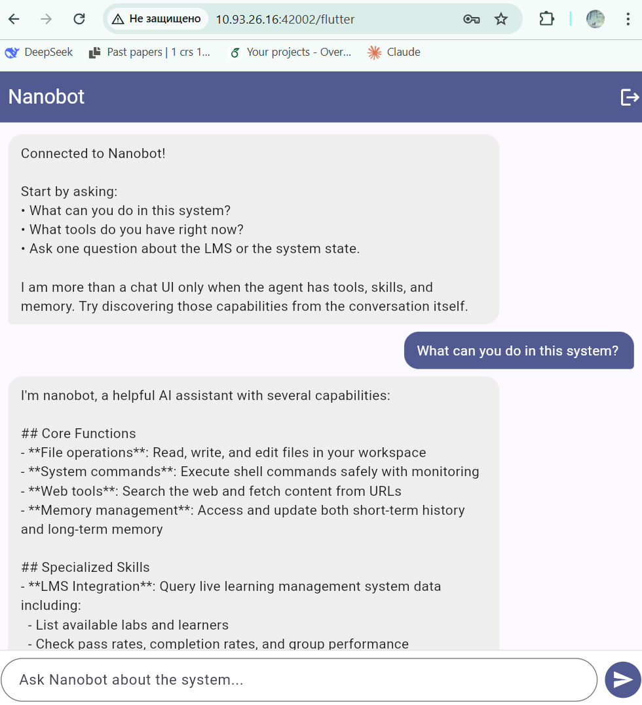
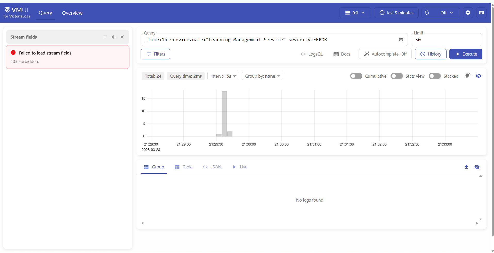

## Task 1A — Bare agent

### What is the agentic loop?
The agentic loop is the fundamental cycle that an AI agent follows to accomplish tasks autonomously: Perceive → Reason/Plan → Act → Observe → Reflect/Iterate. This loop continues until the goal is achieved.

### What labs are available in our LMS?
The agent explored local repo files and found Lab 8 tasks (Task 1-4 required, Task 1 optional). It did NOT return real backend data — answered from documentation instead.

## Task 1B — Agent with LMS tools

### What labs are available?
Lab 01–Lab 07 and lab-08 — real data from backend via mcp_lms_lms_labs tool.

### Is the LMS backend healthy?
Agent called lms_health and returned real health result with item count.

### Which lab has the lowest pass rate?
Agent chained lms_labs + lms_completion_rate for each lab. Lab 08 has 0% (no submissions yet), among active labs — Lab 02 and Lab 03 tied at 89.1%.

## Task 1C — Skill prompt

### Show me the scores (without specifying a lab)
Agent called lms_labs first, then asked which lab to show scores for, presenting all 8 labs as a numbered list.

## Task 2A — Deployed agent

Nanobot gateway started successfully on port 18790.
Logs show: "Starting nanobot gateway version 0.1.4.post5"
MCP LMS server connected.
No channels enabled yet (webchat added in Part B).

## Task 2B — Web client

Flutter web client accessible at /flutter, protected by NANOBOT_ACCESS_KEY.
Agent answers questions using real LMS data via MCP tools.



## Task 3A — Structured logging



### Happy-path log excerpt
```
request_started → auth_success → db_query (INFO) → request_completed (200)
trace_id=305c90833e99c6aae1ebe1e802523fcb
```

### Error-path log excerpt
```
request_started → auth_success → db_query (INFO) → db_query (ERROR) → items_list_failed_as_not_found → request_completed (404)
trace_id=6566cfd8d142cc017985ad4aea24f566
```

## Task 3A — Structured logging


### Happy-path log excerpt
```
request_started → auth_success → db_query (INFO) → request_completed (200)
trace_id=305c90833e99c6aae1ebe1e802523fcb
```

### Error-path log excerpt
```
request_started → auth_success → db_query (INFO) → db_query (ERROR) → items_list_failed_as_not_found → request_completed (404)
trace_id=6566cfd8d142cc017985ad4aea24f566
```

## Task 3C — Observability MCP tools

### Normal conditions (no errors)
"Good news! There have been no errors reported by the Learning Management Service in the last 10 minutes."

### After stopping PostgreSQL
"I can confirm there have been 2 errors in the Learning Management Service in the last 10 minutes. Both errors show: [Errno -2] Name or service not known. This indicates the LMS service is having trouble connecting to its database."

## Task 4A — Multi-step investigation

**Agent response to "What went wrong?":**

"I can see there have been 4 errors in the Learning Management Service in the last 10 minutes. All errors show [Errno -2] Name or service not known — the service cannot connect to the database because it can't resolve the database hostname. All errors occurred during SELECT operations on the 'item' table. This explains why we couldn't retrieve the list of available labs — the LMS service is experiencing database connectivity problems."

## Task 4B — Proactive health check

Agent created a cron job (ID: 791f2c8b) running every 2 minutes.
"List scheduled jobs" confirmed 1 active job: LMS Health Check every 120s.

**Proactive report while PostgreSQL was stopped:**
"I've checked the LMS health and found that the system is currently unhealthy. There appears to be an issue with the backend service, as it's returning an HTTP 404 error. The item count couldn't be determined due to this error."

## Task 4C — Bug fix and recovery

### Root cause
Planted bug in `backend/src/lms_backend/routers/items.py` in `get_items()`.
A broad `except Exception` block caught ALL exceptions (including DB connection errors) and returned misleading `404 Items not found` instead of the real error.

### Fix
Split exception handling into two cases:
- `SQLAlchemyError` → `503 Service Unavailable` with real DB error message
- `Exception` → `500 Internal Server Error` with real error message

### Post-fix failure check
After redeploy with PostgreSQL stopped, agent reported:
"Multiple requests to /items/ endpoint are failing with HTTP 500 status codes. The underlying error is [Errno -2] Name or service not known during database queries."
Real error (500) now visible instead of misleading 404.

### Healthy follow-up
After PostgreSQL restarted:
"Good news! No ERROR or WARN level logs for the Learning Management Service in the last 2 minutes. System is healthy with 56 items in the database."
